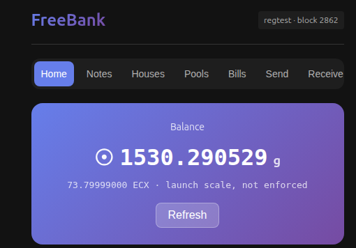

# FreeBank

**Credit creation on a BIP 300/301 drivechain.** FreeBank is a Bitcoin sidechain for
free banking — *discount houses* issuing redeemable credit notes against attested
reserves, and *bills of exchange* backed by an escrow bond — in the lineage of Scottish
free banking (1716–1845), cryptographically translated. It runs as a CUSF/BIP 300–301
sidechain alongside the drivechain enforcer.

> Be your own bank. Make your own credit.

This is an exploration. It may or may not work out — but it illustrates just another
possibility that drivechains open up: not only new execution environments or scaling, but
new *monetary* arrangements settling against Bitcoin.

FreeBank is a C++ fork of the BitAssets sidechain chassis (MIT). It is **experimental,
pre-audit software** — run it on regtest/testnet/signet with test coins only.

> **New here?** Start with [`FREEBANK_GUIDE.md`](FREEBANK_GUIDE.md) — a single self-contained
> knowledge document (thesis, a verified regtest quick start, the full instrument cookbook,
> gotchas, parameters, glossary) written so you can hand it to an AI assistant and be walked
> through running your own FreeBank.

## What works today

- **BIP 300/301 sidechain**: activates into a slot, advances by blind-merged-mining (BMM),
  credits deposits (M5), produces withdrawal bundles (M3) and completes the withdrawal
  payout (M6) — the full peg-out cycle.
- **CUSF enforcer transport**: FreeBank talks to the mainchain through the CUSF
  `bip300301_enforcer` gRPC surface, invoked at runtime via `grpcurl` (nothing of the
  enforcer is vendored or linked). BMM, deposit crediting and the **full withdrawal
  peg-out** are verified end-to-end on this path (revalidated against upstream
  `135115b`, July 2026); withdrawal bundles use the enforcer's `BlindedM6` wire layout.
- **Bills of exchange** (the credit primitive): a unique, stateful instrument with
  `bill_id = sha256(encrypted_body)` as its identity (the node never decrypts the body),
  a face amount, a maturity + grace window, a consensus-enforced escrow bond posted by the
  acceptor, and ownership advanced by endorsement. Full lifecycle — issue → endorse →
  retire/default with escrow claim — runs on-chain. RPCs: `issuebill`, `endorsebill`,
  `retirebill`, `claimbillescrow`, `listbills`, `getbill`, `listmybills`.
- **Discount houses** (the issuers): registered on-chain with a pledged escrow bond and
  M-of-N partner governance; lifecycle register → top-up / admit / exit → wind-down →
  reclaim, with time-locked exit tails and a one-governance-op-per-house-per-block rule.
  RPCs: `registerhouse`, `listhouses`, `attesthouse`, and friends.
- **Credit notes** (the money): per-house redeemable credit claims. Issuance is
  **reserve-gated at mint** — a mint must prove live reserves against the cap; notes
  transfer person-to-person; the issuing house redeems at par from reserves.
- **Bearer redemption** (the holder's teeth): a note holder places a formal *demand* for
  par. Against an open house this **pre-authorises** the payout — the note coins move into
  a consensus-enforced custody script and the house **discharges** them unilaterally,
  paying par plus any in-window interest less a redemption spread, no holder signature
  needed at payout. If the house lets a demand lapse, the holder **protests** it; a live
  protest is a stress origin that turns off the house's par lamp and blocks minting, and
  if the house cannot recover it ripens into insolvency where the bearer claims the custody
  coin directly from reserves. A protest that rides through a lawful deferral re-arms at the
  recovery height rather than being cleared by it. RPCs: `mintnote`, `transfernote`,
  `redeemnote`, `demandnote`, `protestnote`, `dischargedemands`, `listmynotes`.
- **Discounting** (credit creation, the point of the whole thing): a house buys a bill of
  exchange from a holder, paying with its **own notes minted in the same operation** under
  the full reserve/leverage discipline, and books the bill as a loan asset — the Scottish
  discount-house mechanism, on-chain. Because the discount appends a real chain link,
  recourse on a defaulted bill runs holder-passive: the paying party (drawer, acceptor, or
  any prior endorser, the discount seller included) is subrogated in a fixed cascade, and a
  match-funding rule caps the book a house may build against its free escrow. Ops:
  discount, recourse, house-side retire/claim.
- **Reserve attestation and a lazy solvency machine**: houses attest their liquid till on
  a consensus cadence, proven coin-by-coin against the UTXO set. A missed cadence derives
  *Stressed*; an expired recovery window derives *Insolvent* — both computed at read time
  from on-chain heights (inherently reorg-safe). Insolvency triggers a waterfall:
  noteholders claim pro-rata from the locked escrow pot, then a whole-house residual
  settlement.
- **The option clause**, translated from the Scottish record: a stressed house may defer
  redemption for a bounded window, paying interest for the privilege, with its till locked
  into the claim pot; a consensus redemption spread (*brassage*) adds run-friction.
- **Term deposits**: time-locked deposits with a consensus interest floor and transferable
  receipts, subordinated to notes in the insolvency waterfall.
- **Clearing pools**: on-chain AMM pools between a house's notes and the base coin —
  swaps, LP shares, and orderly pool retirement. RPCs: `createpool`, `listpools`,
  `swapnote`, `addpoolliquidity`, `removepoolliquidity`, `listmylp`, `retirepool`.
- **Metric denomination (display)**: RPCs report values in grams alongside base units at
  a fixed launch scale (`getgramrate`). Presentation-only — no consensus rule reads it.

## Robustness

Consensus code is only as trustworthy as what tries to break it. Much of the work is
adversarial. The v0.2.7 line closes the two consensus issues that v0.2.6 shipped as
known-open, v0.2.7.1 closes a memory leak that fuzzing turned up, and v0.2.8 closes
three consensus defects found by a line-by-line audit of the money paths inherited
from the upstream sidechain chassis:

- **Value conservation: the vestigial colored-coin subsystem is retired** (v0.2.8).
  The chassis FreeBank was forked from shipped a generic asset-issuance feature
  (transaction version 10, `createasset`/`transferasset`) that excluded its genesis
  outputs from both halves of the value-conservation check while still crediting
  their value to the UTXO set — a raw transaction could mint base coin from nothing.
  No FreeBank instrument ever used it (bills, houses, notes, deposits, pools,
  settlement and the oracle are transaction versions 11–17), so the subsystem is
  removed outright: v10 transactions are now rejected at the transaction-check layer
  and the RPCs are gone.
- **Withdrawal burns are consumed exactly once** (v0.2.8). The burn output that
  backs a withdrawal request was inspected but never marked spent, so one burn
  could stand behind any number of withdrawal rows — and each row is a claim on the
  mainchain payout. Each burn output is now claimed at most once per transaction,
  mirroring the deposit-side fix this project shipped earlier; a withdrawal row is
  also erased if the block that created it is disconnected.
- **Withdrawal-bundle ordering is a total order** (v0.2.8). Bundle assembly sorted
  withdrawals by fee with an unstable sort, so fee ties could order differently
  between Linux (libstdc++) and macOS (libc++) — and payout order is compared
  exactly at validation, which is a cross-platform chain split waiting for a tie.
  Ties now break on the withdrawal id, which is platform-independent.
- **Sidechain-object parser fails closed** (v0.2.7.1). The parser for sidechain-object
  outputs allocated an object before deserializing into it, with no exception guard, so a
  malformed payload leaked it. Because that parser runs during mempool acceptance ahead of
  input and fee checks, and the resulting reject carried no misbehaviour score, any peer
  could repeat it for free. It now frees the object and rejects cleanly. No accept/reject
  decision changed, so a v0.2.7.1 node and a v0.2.7 node stay on the same chain.
- **Deposit reorg safety.** The deposit database's CTIP pointer is now rolled back when a
  block is disconnected, so a node that reorgs across a deposit-bearing block computes the
  same payouts as a freshly synced one. Before the fix, a reorg could strand or
  mis-pay a depositor. (Closes the last known chain-split class; advances the on-disk
  format, so an upgraded datadir re-reads once with `-reindex`.)
- **Signature canonicality.** Every operation's payload signature is now verified
  strict-DER and low-S at a single choke-point, so a keyless relayer can no longer
  re-encode a payload signature to shift an unconfirmed transaction's id.
- **Two-node convergence.** A second node boots before the first block exists and
  independently validates every block from genesis; both must match on tip, the full UTXO
  set, and every side-database (bills, houses, notes, deposits, pools, oracle) at each
  checkpoint — catching any rule written differently in the producer than the validator.
- **Reorg coverage** across every operation family, asserting disconnect is an exact
  inverse — including a deep (200+ block) reorg replayed byte-for-byte against a
  never-connected control node.
- **Recovery + format guard.** `-reindex` reproduces the chain exactly, including from a
  datadir written by an earlier version; a node reading records it cannot parse refuses to
  start and names the remedy rather than silently misparsing them.
- **Mempool-slot safety.** House-slot-taking wallet operations fail fast when another
  state-changing op for the same house is already pooled, instead of building a
  transaction the validator will reject.

28 integration gates and 446 unit tests. All must pass to merge.

## Wallet (preview)

A wallet GUI — desktop and browser (PWA) — is in development against a running
`freebankd`: notes, houses, clearing pools and bills, with balances led in grams.



Wallet code: [mbdrivechains/freebank-gui](https://github.com/mbdrivechains/freebank-gui).

## Build

Native build (Ubuntu 24.04 shown; other platforms per standard Bitcoin Core build docs):

```sh
./autogen.sh
./configure --without-gui --with-incompatible-bdb --disable-bench
make -j"$(nproc)"
```

Binaries land in `src/`: `freebankd`, `freebank-cli`, `freebank-tx`.

> **These native binaries are NOT portable.** They link against your system's
> libraries and run only on the machine/distro that built them. The published
> release binaries are built statically (Linux via `depends`, ldd-gated to base
> libraries only; macOS via the repo's `macos-arm64` workflow) — use those, or a
> `depends` static build, for anything you intend to run on another host.

Run the unit tests:

```sh
src/test/test_bitcoin
```

## Run (overview)

FreeBank is a sidechain, so running it means running a small stack: a
(drivechain-patched) signet `bitcoind` as the mainchain, the CUSF
[bip300301_enforcer](https://github.com/LayerTwo-Labs/bip300301_enforcer) watching it —
it validates the drivechain rules and holds the mainchain wallet — and `freebankd`
driving the enforcer over gRPC (via
[grpcurl](https://github.com/fullstorydev/grpcurl)). The sidechain then advances by
blind-merged-mining against the mainchain (`freebank-cli refreshbmm`). The mainchain
node comes from LayerTwo Labs'
[bitcoin-patched](https://github.com/LayerTwo-Labs/bitcoin-patched); FreeBank binaries
from the [release page](https://github.com/mbdrivechains/freebank/releases).

Two things worth knowing before you start:

- **The current network is a stopgap.** FreeBank presently runs against its own
  project-operated signet — the chain behind [ecxfreebank.com](https://ecxfreebank.com),
  reset daily. The intended home is the LayerTwo Labs drivechain signet: once FreeBank's
  slot-130 activation (M1) lands there, the same stack simply points at that network
  instead.
- **The full walkthrough is a separate page**: [`doc/signet.md`](doc/signet.md) —
  written for someone starting from zero, with every dependency linked, the
  network/magic-bytes pitfalls explained, join parameters for the FreeBank signet, and a
  step-by-step verification order. It is deliberately precise enough to hand to an AI
  coding agent — if you'd rather not drive four pieces of software by hand, pointing
  Claude Code (or another agentic assistant) at that page and asking it to do the
  bring-up with you works well.

## Feedback

- **Problems / bugs** — open an [issue](https://github.com/mbdrivechains/freebank/issues)
  (the template asks for version, platform, and steps).
- **Ideas, questions, discussion** — use
  [Discussions](https://github.com/mbdrivechains/freebank/discussions).
- **Security vulnerabilities** — please email privately first: see
  [`SECURITY.md`](SECURITY.md).

## License


MIT — see [`COPYING`](COPYING). Inherited from Bitcoin Core / the BitAssets chassis.

## Status

Alpha. Consensus surfaces (bills, houses, notes and bearer redemption, discounting,
attestation/insolvency, redemption economics, term deposits, clearing pools,
deposits/withdrawals, the transport layer) have unit + integration coverage and
adversarial review; the full peg-out cycle is verified end-to-end against the CUSF
enforcer (upstream ≥ `135115b`) on regtest. Reserve and solvency parameters are
provisional pending simulation. Not yet audited; do not use with real value.

**Closed since v0.2.6.** The two consensus issues the previous release listed as
known-open are both fixed in v0.2.7: the deposit CTIP pointer is now rolled back on a
reorg (deposit reorg safety), and payload signatures are now verified strict-DER and
low-S at a single choke-point (signature canonicality). v0.2.8 closes the three
consensus defects found by an internal audit of the inherited money paths (value
conservation, withdrawal-burn consumption, withdrawal-bundle ordering — see
Robustness above). v0.2.8 is a consensus change: a v0.2.8 node rejects transaction
version 10 outright and enforces one-payout-per-burn, so upgrade before the chain
you follow does. On chains that never carried a v10 transaction or a double-claimed
burn — all known deployments — v0.2.8 revalidates the existing history unchanged.
No consensus-level defect is currently outstanding on this list; the standing
caveats are the ones above — provisional economic parameters and no third-party
audit. Still test-coin software: do not use with real value.
